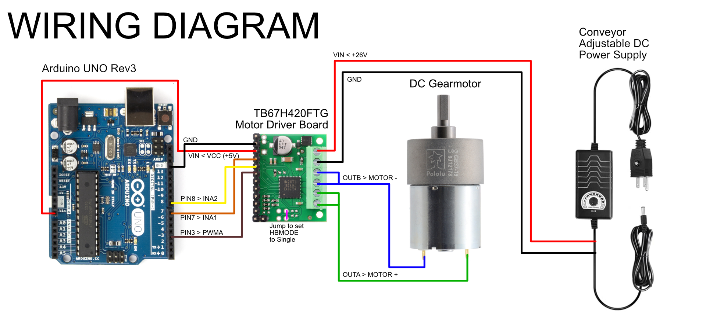

# Conveyor for Angela Nguyen: A Step by Step Guide

## Ingredients

### Tools and Supplies

* Wire Cutters
* Wire Strippers
* Soldering Iron
* Solder
* Breadboard for Prototyping
* [Protoboard for Fabrication](https://a.co/d/35qn1xX)
* Jumper Wires

### Hardware

* [Belt Conveyor 39 inch Conveyor Desktop Version Step-Less Speed Adjustment PVC Belt Conveyor for Packaging Factory, Production Line, Home](https://www.amazon.com/Moonshan-Step-Less-Adjustment-Packaging-Production/dp/B0CCP8NSSJ)
* Arduino Uno
* [TB67H420FTG Dual/Single Motor Driver Carrier](https://www.pololu.com/product/2999)

### Software

* Git
* Arduino IDE

## Software Setup

1. [Download and Install Arduino IDE](https://www.arduino.cc/en/software/)
2. Follow [this guide](https://github.com/git-guides/install-git) to ensure Git is installed.
3. From the command line, clone this repo: `git clone https://github.com/phillipdavidstearns/angela-nguyen-conveyor.git`

...

## Hardware Setup

1. Cut the power cord coming from the speed controller output 6" inches from the end.
1. Strip and tin the ends.
1. Assemble the TB67H420FTG Dual/Single Motor Driver Carrier according to the guide [linked here]()
	* Set the H Bridge Mode to single motor by jumping the HBMODE contact to VCC on the Driver Board.
	* Wire up power connections from the speed controller to the VIN and GND terminal blocks on the Motor Driver Board
	* Wire up the 6" clipped power connection to the A and B motor connections according to the Single mode diagrams in the guide.

