# Conveyor for Angela Nguyen: A Guide

[Video Overview](https://www.dropbox.com/scl/fi/yhlidz706ze4x9pxzm99j/ConveyorControl.mp4?rlkey=eh94c7knrupum027y0mjz79xq&dl=0)

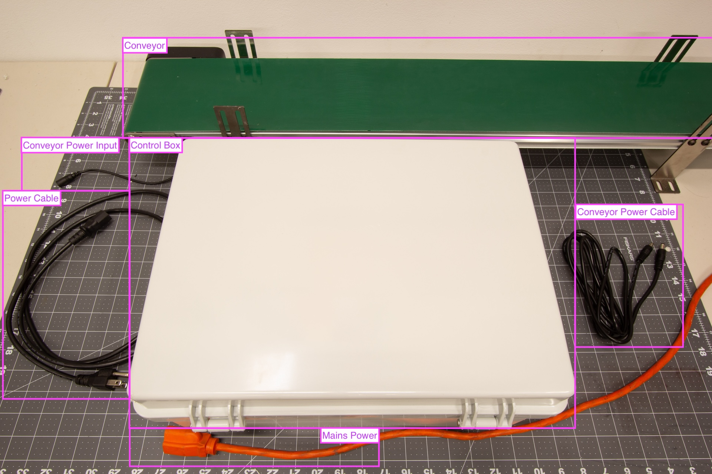

A guide for setting up, operating, updating and understanding how everything works.

## Basic Connections:

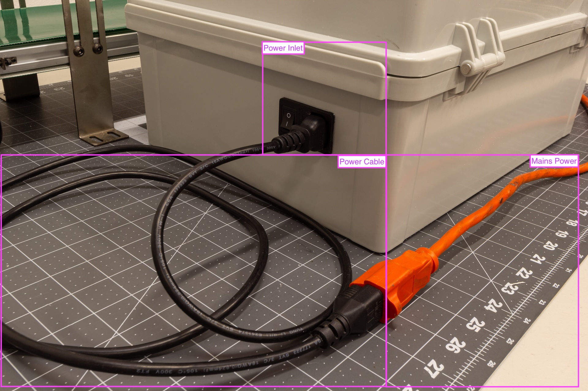

* The control box connects to mains power through an NEMA 5-15 to IEC 60320 C13 cable.
* The inlet is switched and fused.
* `0` is OFF, `1` is ON

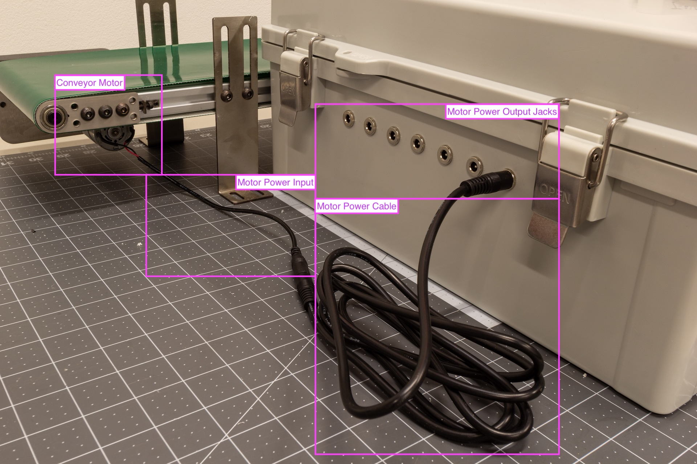

* Across the top of the box are the motor power outputs.
* With the box oriented with the top facing you and the outputs along the top, they are numbered 1-7 from left to right.
* Use 5.5mm x 2.1mm extension cables to connect from the box to the motors.

## Internals

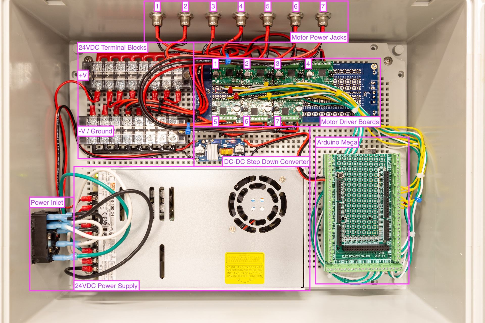

* **Power Inlet** is switched and fused.
	* Green = Ground/Common
	* Black = Line/Hot
	* White = Neutral/Return
* **[24VDC Power Supply]()** is rated for 600W
	* [Mean Well LRS-600-24 600W 24V 25A Switching Power Supply](https://a.co/d/dNw7nDB) 
	* +V = 24V
	* -V = Ground
* **Terminal Blocks**
	* Red = +V
	* Black = Ground
* **[DC-DC Voltage Converter](https://a.co/d/4V5UGZK)**
	* Converts 24V to 8V to power the Arduino
	* Adjustable via multi-turn trim potentiometer
* **[Arduino Mega](https://docs.arduino.cc/hardware/mega-2560/) with [Terminal Block Shield](https://a.co/d/6RRjxia)**
* **[TB67H420FTG Dual/Single Motor Driver Carrier](https://www.pololu.com/product/2999)**
	* Configured to drive a single motor on PWMA, INA1 and INA2 pins.

```
Pin Mapping from Motor Driver to Arduino
MOTOR	ARDUINO PINS
CHANNEL	PMW		INA1	INA2
		YELLOW	WHITE	GREEN
-----------------------------
1		2		22		23
2		3		24		25
3		4		26		27
4		5		28		29
5		6		30		31
6		7		32		33
7		8		34		36
```

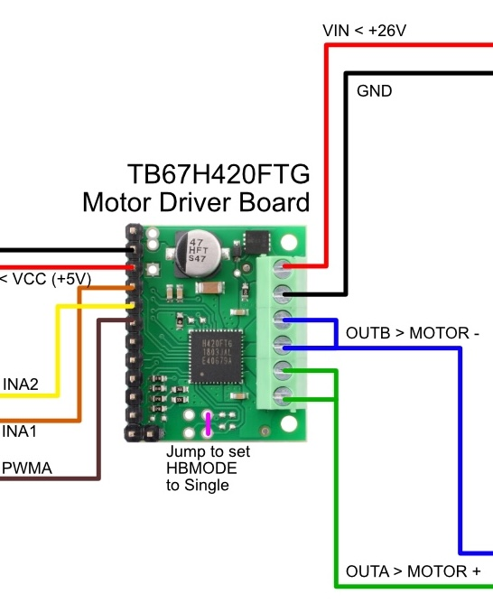

### Additional Project Hardware:

* [Belt Conveyor 39 inch Conveyor Desktop Version Step-Less Speed Adjustment PVC Belt Conveyor for Packaging Factory, Production Line, Home](https://www.amazon.com/Moonshan-Step-Less-Adjustment-Packaging-Production/dp/B0CCP8NSSJ)
* [Project Enclosure](https://a.co/d/ejkUgKV)


## Updating/Programming The Arduino

If the software needs to be updated or you want to customize the code, you'll need to download the code from the repository and upload it by following the instructions below:

### Download the Code

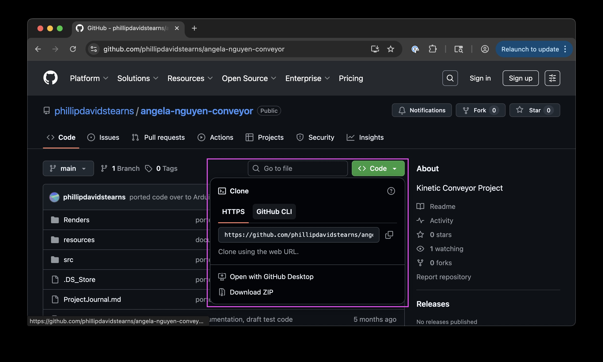

1. Navigate to [https://github.com/phillipdavidstearns/angela-nguyen-conveyor](https://github.com/phillipdavidstearns/angela-nguyen-conveyor).
1. Click the `<> Code` button and select the option that works best for you. Use "Download ZIP" if those other ones don't make sense.
1. Unzip the files if you downloaded the zip.


### Setting up Arduino IDE

1. [Download and Install Arduino IDE](https://www.arduino.cc/en/software/)
1. Navigate to the Arduino `controller_test_mega.ino` file in the repository path `src/controller_test_mega/`
1. Double click to open the file in the Arduino IDE.
 
### Uploading to Arduino

1. **!!! Make sure power to the control box is turned off BEFORE making connections!!!**
1. Connect your computer to the Arduino board using a USBA cable.
1. Select the appropriate board: `Arduino Mega or Mega 2560`

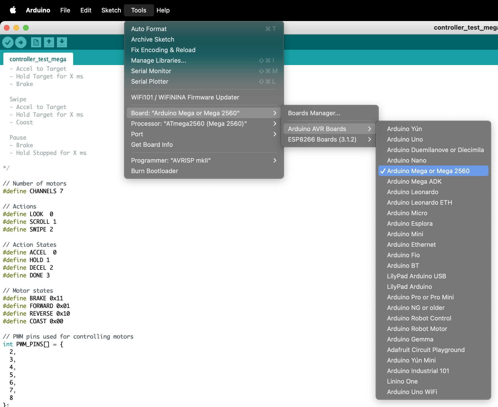

1. Select the appropriate processor: `ATmega2560 (Mega 2560)`

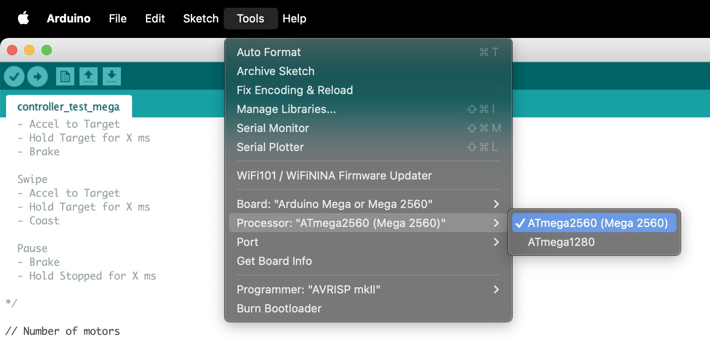

1. Select the appropriate port: typically USB will be labelled with the arduino board.

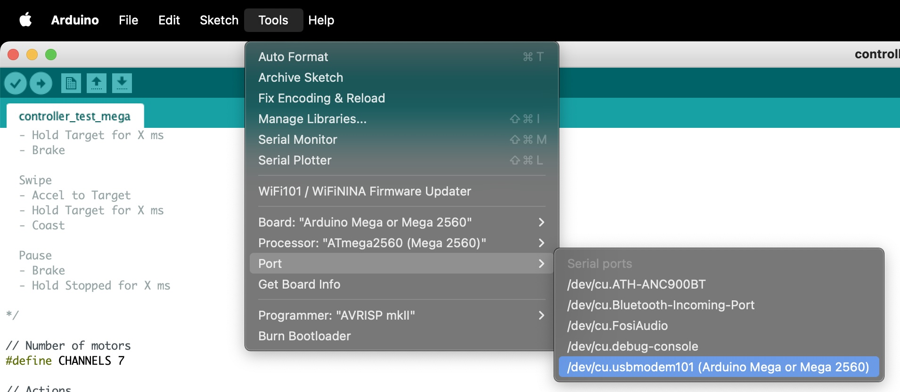

1. Press the Upload Arrow to upload the program to the Arduino.

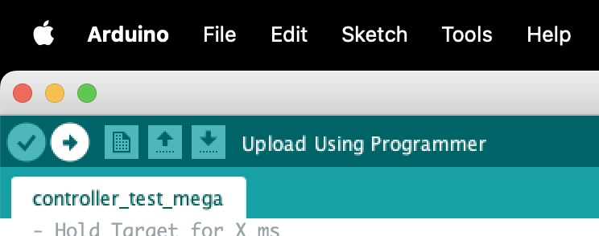

1. If all is right in the world: SUCCESS!

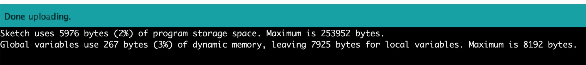

